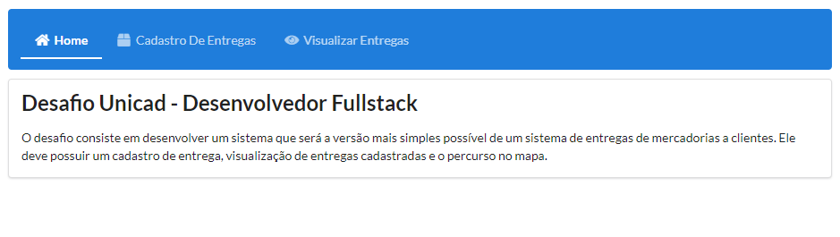
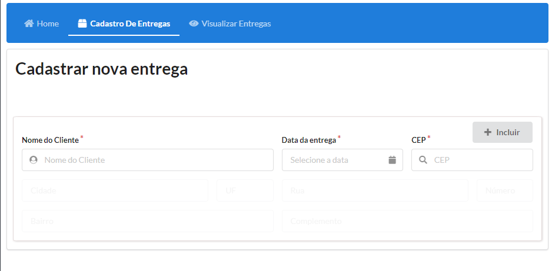
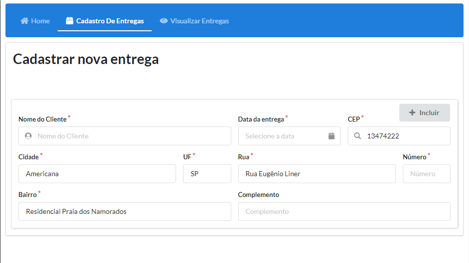
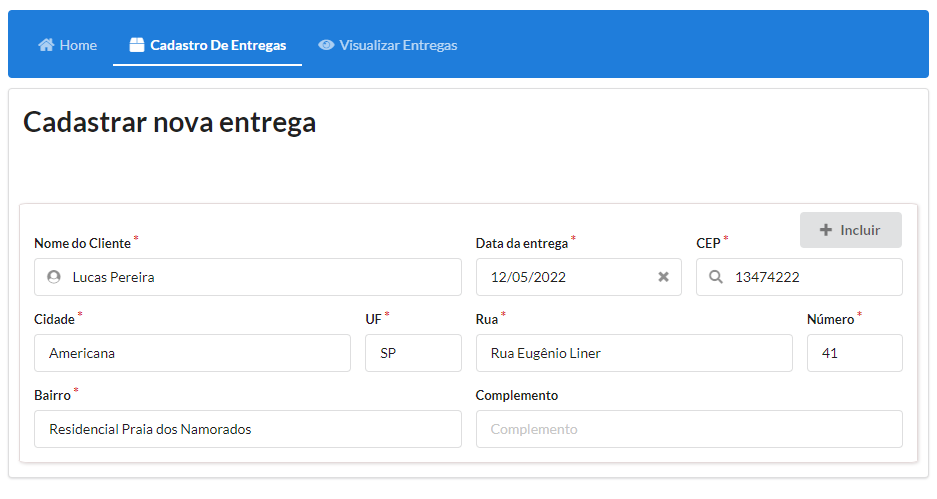
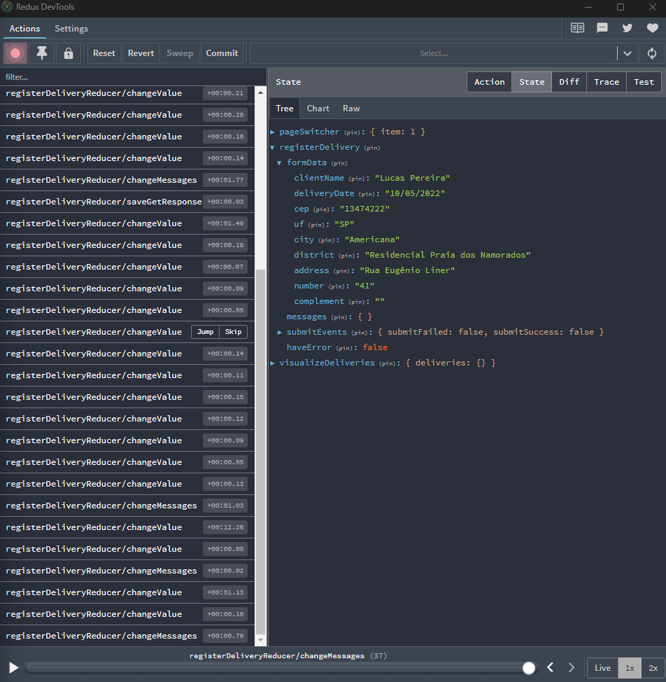

# Desafio Unicad FullStack

O desafio consiste em desenvolver um sistema que será a versão mais simples possível de um sistema de entregas de mercadorias a clientes. Ele deve possuir um cadastro de entrega, visualização de entregas cadastradas e o percurso no mapa.

## Tempo do projeto

O desenvolvedor tem o tempo de dois dias para realizar o teste e tentar avançar o máximo possível.

## Prints de tela:

Ao entrar no projeto, o usuário verá a tela de home, em uma versão bem simplificada de começo:

    

Ao selecionar no menu a opção de cadastro de entregas, o usuário se depara com um formulário, onde deverá preencher as informações corretamente:

    

Preenchimento automático com cep:

    

Desenvolvi uma validação e estruturei para adicionar outras, mas devido ao tempo, consegui criar essa totalmente funcional:

    

Demonstração do redux em funcionamento:

    

    

### Funcionalidades

- [x] Menu com troca de páginas dinâmica
- [x] Implementação do Redux Toolkit
- [x] Página inicial
- [x] Página para cadastro de novas entregas
- [ ] Página para visualizar cadastros
- [x] Integração com API busca Cep
- [ ] Integração com API do Google Maps
- [ ] Integração com backend desenvolvido por mim
